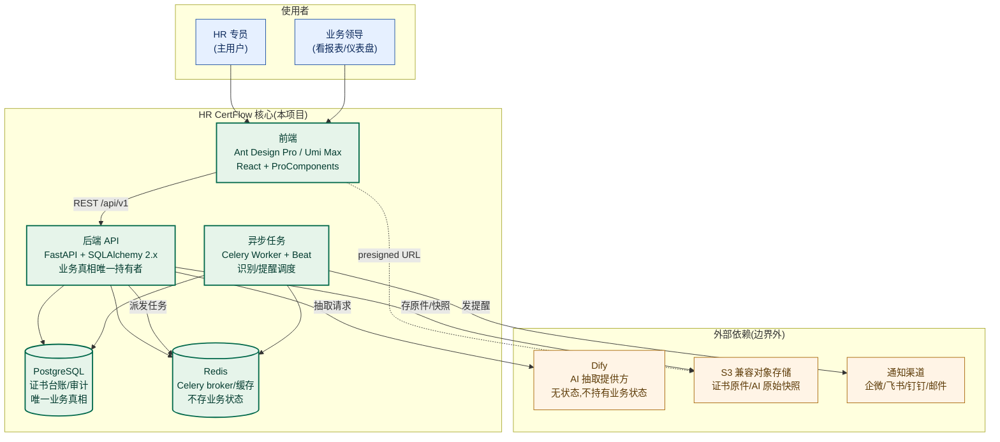
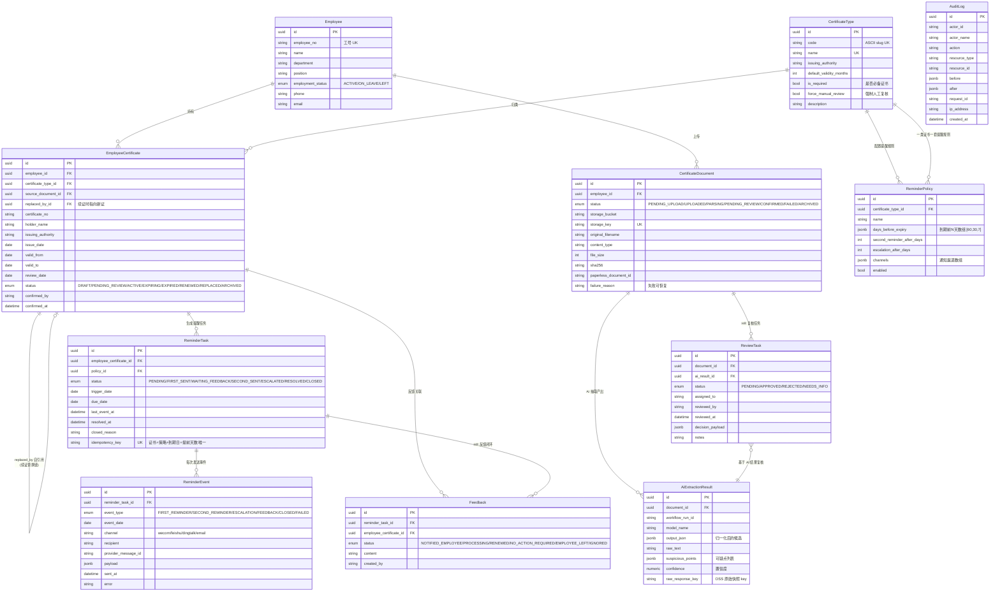
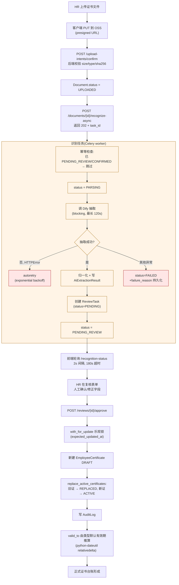
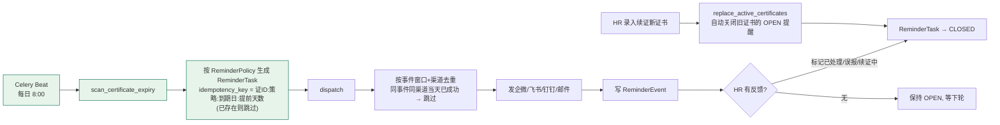
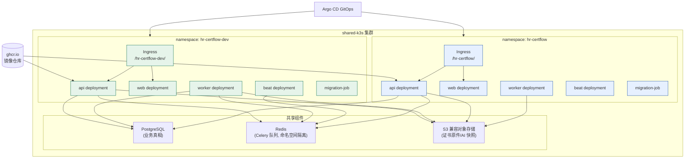
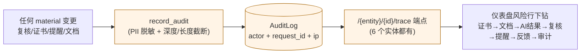

# HR CertFlow 项目全景

> 这份文档用图 + 精炼文字讲清楚"这个项目在做什么"。一图定位、二图建模、
> 三图讲流程、四图讲部署。细节边界看 [architecture.md](architecture.md)，
> 交付目标看 [delivery-north-star.md](delivery-north-star.md)。

## 一句话定位

HR CertFlow 是**企业内部 HR 证书全生命周期管理系统**（system of record）——
从员工上传证书照片、AI 抽取结构化数据、HR 人工复核确认、形成正式证书台账，
到证书到期前自动提醒、续证后替换旧记录、全程审计可追溯，覆盖证书的
**"录入 → 复核 → 台账 → 提醒 → 续证 → 审计"** 完整闭环。

它**不是**证书 OCR 工具、不是 AI 展示项目、不是 demo。北极星标准是：
HR 能在没有开发介入的情况下，独立完成日常全部证书运营。

## 一、系统定位图（C4 容器级）

**关键边界（AGENTS.md 硬约束）：**
- **业务真相只在 PostgreSQL**——证书状态、复核状态、提醒状态、审计全部在这里
- **Dify 只是抽取提供方**——给它文件 URL，返回结构化 JSON 候选，它**不持有**任何业务状态
- **Redis 只做 broker/缓存**——不做业务真相
- **对象存储只存文件和不可变快照**——不做状态判断

## 二、领域模型图（ER）

系统的核心是**一张证书从录入到作废的生命周期**。11 个实体围绕这条主线协作。

**最值得注意的四个设计：**

1. **`EmployeeCertificate.replaced_by` 自引用**——续证不是覆盖旧记录，而是新建一条 ACTIVE，把旧记录改 REPLACED 并指向新记录。证书历史完整保留。
2. **数据库部分唯一索引兜底业务正确性**——`uq_employee_certificate_one_current_per_type` 保证每个员工每类证书只能有一个 ACTIVE/EXPIRING。并发下应用层校验有竞态，DB 约束是最后一道防线。
3. **失败状态是一等公民**——`CertificateDocument.status=FAILED` + `failure_reason` 持久化，UI 可重新识别/恢复，不丢数据。
4. **AuditLog 独立实体**——不继承 TimestampMixin，使用自己的 `created_at`。记录所有 material 变更的 before/after 快照，支持 PII 脱敏和深度截断。

## 三、核心业务流程图

### 流程 A：证书录入到正式台账（主流程）

### 流程 B：到期提醒闭环

**幂等设计的两个关键：**
- `idempotency_key` 确定性生成 → 同一证书同一策略同一天不会重复建任务
- `uq_reminder_event_success_once_per_day` 部分唯一索引 → 同事件同渠道当天成功事件唯一

### 流程 C：报表与导出

系统提供两类报表，支持 JSON 和 CSV 导出：

1. **仪表盘（Dashboard）**——实时汇总：员工数、覆盖率、各状态文档/证书/复核/提醒计数、证书状态分布、工作负载图表、流水线步骤、风险行（可下钻到源记录）
2. **证书覆盖率报表（Reports）**——按部门统计覆盖率、按证书类型统计风险（有效/即将到期/已过期/缺失员工）、按到期月份分布

**CSV 导入/导出能力：**
- 导出：员工、证书类型、持证记录、文件台账、提醒任务、覆盖率报表均支持 CSV 导出
- 导入：员工支持 CSV 批量导入（UTF-8 BOM / GB18030 编码，中英文字段别名映射，按工号去重）

## 四、部署拓扑图

**环境隔离的关键设计：**
- **Celery 全链路命名空间隔离**——dev 和 release 用不同的 queue/routing-key/redis-prefix（`config.py` 的 `resolved_*` 派生属性），避免 dev 的任务跑到 release 队列
- **生产走 Alembic migration**——`auto_create_tables` 默认 False，只有 local 开发显式 opt-in（整改后）
- **认证过渡态**——`auth_required` 默认 False 不阻塞 CI，真业务上线前切 True + 配网关 OIDC
- **Probe 任务**——CI/CD 通过 `app.tasks.probe` 验证 worker 环境配置正确（APP_ENV、queue、routing-key）

## 五、审计与可追溯（横切能力）

每一个影响 HR 决策的状态变更，都必须能追溯到源头。这不是事后补的日志查询，而是**产品级的一等能力**。

**核心规则：** 仪表盘上的每个数字，都必须能下钻到具体的源记录。不允许前端-only 的近似计算。

**审计加载优化（P2.B 整改）：** 6 个 trace 端点的审计日志加载逻辑已收敛到共享 helper `load_audit_logs_for_resources`，dashboard 的 5 个风险下钻分支改为 table-driven dispatch。

## 六、整改后的运行时模型（2026-06 现状）

P0-P3 整改已完成（详见 [remediation-backlog.md](remediation-backlog.md)）。整改带来的运行时变化：

| 维度 | 整改前 | 整改后 |
|---|---|---|
| API 路由并发模型 | async def + 同步 DB（阻塞事件循环） | 全 sync，FastAPI 自动丢线程池 |
| 识别请求 | 同步阻塞 120s | Celery 任务化，前端轮询 |
| 生产建表 | auto_create_tables 默认 True（有风险） | 默认 False，非 local fail-fast |
| 认证 | actor header 零校验 | trusted proxy + auth_required 过渡态 |
| 失败恢复 | 用户手动重试 | Celery autoretry + 幂等 guard |
| 审计加载 | 6 处重复实现 | 共享 helper + dashboard dispatch |
| 中间件 | BaseHTTPMiddleware（每请求创建 task） | 纯 ASGI middleware |
| 模块级配置 | import 时实例化 engine/celery | `@lru_cache` 函数，测试可替换 |
| 日期计算 | 手写月份算术（5 行） | python-dateutil relativedelta |
| boto3 client | 每次调用新建 client | 实例级 lazy 缓存 |

## 七、当前进度与下一步

- **功能完成度**：核心闭环（录入→复核→台账→提醒→续证→审计）全部可用，绝大多数模块 Partial（见 [delivery-gap-register.md](delivery-gap-register.md)）
- **CI 验证**：104 passed, 25 skipped（DB 依赖用例如无 DATABASE_URL 如实 skip），门禁全绿
- **整改**：P0-P3 全部交付并经 CI 验证，P2.C（Celery 队列拆分）待观察
- **唯一主线缺口**：**release 环境证据**——dev 已有 smoke 证据，release 环境的 Web/API smoke、Celery/Redis smoke、端到端 HR 场景证据待补

完成北极星的判定标准：不是"本地能跑"，而是 **HR 能在 release 环境无开发介入地完成完整业务闭环，且有 GitOps 推送的 dev/release 证据**。
